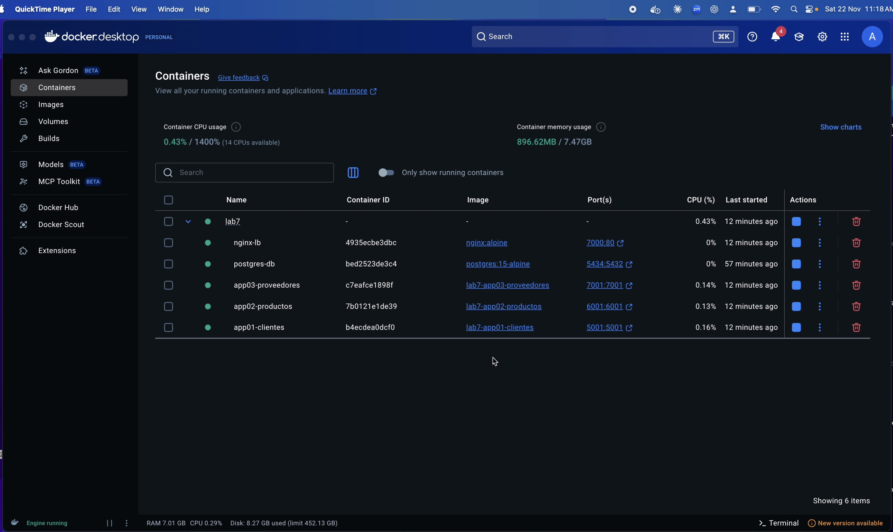
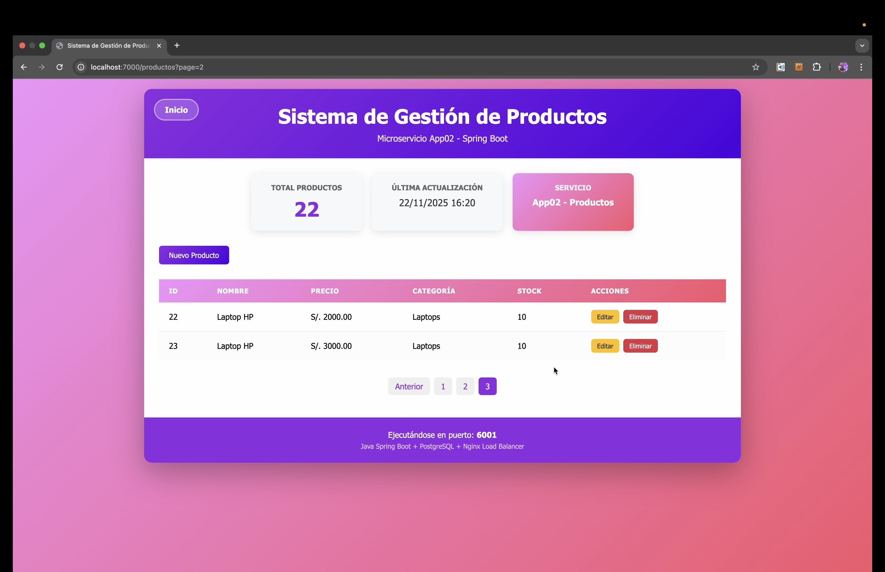
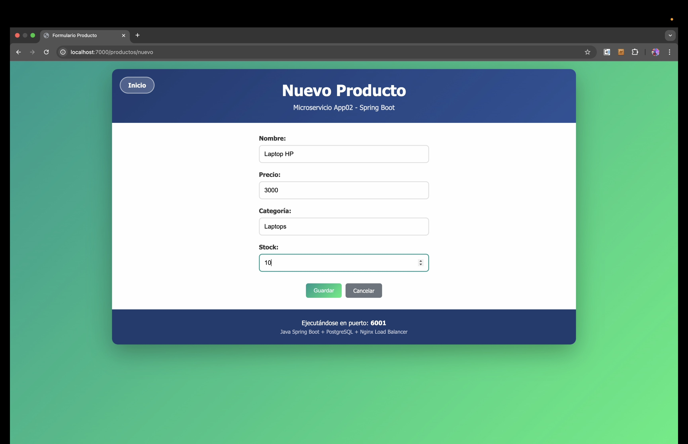

# Load Balancer con Microservicios — Spring Boot + Nginx + Docker

    

Sistema de gestión con 3 microservicios en Java Spring Boot (Clientes, Productos, Proveedores), balanceados por Nginx y orquestados con Docker Compose. Cada microservicio corre en su propio contenedor con su propia instancia de la app, compartiendo una base de datos PostgreSQL.

## 📸 Demo / Capturas

| | |
|---|---|
|  |  |
| Los 6 contenedores corriendo (Nginx + 3 apps + PostgreSQL) | Microservicio de Productos, accedido vía load balancer |



## 🏗️ Arquitectura

```
                    ┌─────────────────┐
                    │   Nginx (LB)    │
                    │   Puerto: 7000  │
                    └────────┬────────┘
                             │
           ┌─────────────────┼─────────────────┐
           │                 │                 │
           ▼                 ▼                 ▼
    ┌─────────────┐   ┌─────────────┐   ┌─────────────┐
    │   App01     │   │   App02     │   │   App03     │
    │  Clientes   │   │  Productos  │   │ Proveedores │
    │ Puerto:5001 │   │ Puerto:6001 │   │ Puerto:7001 │
    └──────┬──────┘   └──────┬──────┘   └──────┬──────┘
           │                 │                 │
           └─────────────────┼─────────────────┘
                             │
                    ┌────────▼────────┐
                    │   PostgreSQL    │
                    │  Puerto: 5434   │
                    └─────────────────┘
```

- **Ruta raíz (`/`)**: Nginx distribuye las peticiones en round-robin entre las 3 apps.
- **Rutas fijas**: `/clientes`, `/productos` y `/proveedores` siempre van a su microservicio correspondiente, sin pasar por el balanceo.

## 🛠️ Tecnologías

- **Backend**: Java 17, Spring Boot 3.2.0, Spring Data JPA
- **Frontend**: Thymeleaf
- **Base de datos**: PostgreSQL 15
- **Load Balancer**: Nginx (proxy reverso + round-robin)
- **Orquestación**: Docker & Docker Compose

## 📋 Requisitos

- Docker
- Docker Compose

## 🚀 Ejecución

1. Clonar el repositorio:
   ```bash
   git clone https://github.com/alvaro-oliveros/spring-boot-load-balancer.git
   cd spring-boot-load-balancer
   ```

2. Construir e iniciar todos los contenedores:
   ```bash
   docker-compose up -d --build
   ```

3. Esperar aproximadamente 30 segundos para que las aplicaciones inicien completamente.

4. Verificar que los contenedores estén corriendo:
   ```bash
   docker-compose ps
   ```

## 🌐 URLs de Acceso

| Servicio | URL | Descripción |
|----------|-----|-------------|
| Load Balancer | http://localhost:7000 | Round-robin entre las 3 apps |
| Clientes | http://localhost:7000/clientes | Siempre va a App01 |
| Productos | http://localhost:7000/productos | Siempre va a App02 |
| Proveedores | http://localhost:7000/proveedores | Siempre va a App03 |

### Acceso directo (sin Load Balancer)
- App01 Clientes: http://localhost:5001
- App02 Productos: http://localhost:6001
- App03 Proveedores: http://localhost:7001

## ✨ Características

- **Load Balancer**: Nginx distribuye las peticiones usando round-robin en la ruta raíz (`/`)
- **Rutas específicas**: Cada microservicio tiene su propia ruta (`/clientes`, `/productos`, `/proveedores`)
- **CRUD completo**: Crear, leer, actualizar y eliminar registros en cada microservicio
- **Paginación**: 10 registros por página
- **Base de datos**: PostgreSQL compartida, con 20+ registros por tabla

### Modelos de datos

**Clientes (App01)** — ID, Nombre, Email, Teléfono, Ciudad
**Productos (App02)** — ID, Nombre, Descripción, Precio, Stock
**Proveedores (App03)** — ID, Nombre, Email, Teléfono, Ciudad

## 📁 Estructura del Proyecto

```
spring-boot-load-balancer/
├── docker-compose.yml          # Orquestación de contenedores
├── init.sql                    # Script de inicialización de BD
├── nginx-loadbalancer/
│   └── nginx.conf              # Configuración del load balancer
├── app01/                      # Microservicio Clientes
│   ├── Dockerfile
│   ├── pom.xml
│   └── src/main/
│       ├── java/                # Controller, Model, Repository
│       └── resources/           # Templates y CSS
├── app02/                      # Microservicio Productos
│   └── ...
└── app03/                      # Microservicio Proveedores
    └── ...
```

## 🔧 Comandos Útiles

```bash
# Ver logs de todos los servicios
docker-compose logs -f

# Ver logs de un servicio específico
docker-compose logs -f app01-clientes

# Reiniciar todos los servicios
docker-compose restart

# Detener todos los servicios
docker-compose down

# Detener y eliminar volúmenes (resetea la base de datos)
docker-compose down -v
```

## 📄 Licencia

Proyecto académico sin licencia formal. Se sugiere licencia **MIT** si se desea reutilizar el código libremente.
